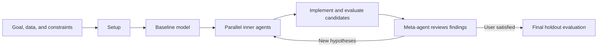

<h1 align="center">
  &nbsp;

  <b>auto-model</b>
</h1>

[](LICENSE)


`auto-model` is a **skill** to guide agents through building or improving a model from data, searching for a better **structure** - by transforming input features, introducing new equation terms, or modifying neural layers.

This skill is designed to be minimal and flexible: it heavily relies on the quality of the agent (claude code, openai codex, opencode etc.). For more complete and comprehensive model or program discovery solutions, consider [OpenEvolve](https://github.com/algorithmicsuperintelligence/openevolve), [ShinkaEvolve](https://github.com/SakanaAI/ShinkaEvolve), [SkyDiscover](https://github.com/skydiscover-ai/skydiscover), etc.

> 🚧 `auto-model` is under construction and experimental. Use at your own risk.

## 🚀 Quick start

Copy the [`auto-model/`](auto-model/) folder into `.agents/skills/` (or `.claude/skills`). Or use  [Vercel Labs' `skills` package](https://github.com/vercel-labs/skills): `npx skills add unlayer-ai/auto-model`.

> 📚 Add any relevant references in `.<agents-OR-claude>/skills/auto-model/references/` if you wish to leverage background info.

Then give the agent a concrete modeling goal:

```text
Help me improve this cardiac fluid dynamics model using the auto-model skill.

The data is in data/measurements.csv.

Minimize validation RMSE while keeping inference below 50 ms.

The final model should remain interpretable and produce non-negative outputs.
```

An existing model is optional. If none exists, the skill creates a baseline before starting the structural search.

## 🤲 What you provide

| Input                      | Required? | Examples                                                        |
| -------------------------- | --------- | --------------------------------------------------------------- |
| Data or data-loading code  | Yes       | CSV files, database export, simulation input and expected output                   |
| Goal and evaluation metric | Yes       | Minimize RMSE, maximize accuracy, satisfy a physical constraint   |
| Existing model             | No        | Regression equation, PDE terms, neural network definition       |
| Constraints                | No        | Interpretable, differentiable, positive, bounded, latency limit |
| Domain references          | No        | Papers, code snippets, known equations placed in `references/`  |

The agent confirms the data split, metrics, parameter optimization routine, runtime, and memory budget before beginning the search.

## 📦 What you get

| Artifact                                 | Purpose                                                               |
| ---------------------------------------- | --------------------------------------------------------------------- |
| `CHECKLIST.md`                           | Progress through the four phases                                      |
| `CONTEXT.md`                             | Living record of decisions, metrics, experiments, and findings        |
| `model.X`                                | Baseline and candidate model implementations                          |
| `meta_m/agent_s/attempt_i/evaluation.md` | Evaluation notes for each candidate                                   |
| `FINAL.md`                               | Final model description, holdout metrics, limitations, and next steps |

Candidate models and their evaluations remain available, so the result includes a documented search history rather than only the winning model.

## 🔄 How it works



During iteration, a meta-agent assigns distinct hypotheses to parallel inner agents. Each inner agent makes sequential structural changes, trains or calibrates each candidate, and evaluates it on the training and validation sets. The meta-agent then compares results, records what worked, and chooses the next search directions.

The held-back test set is used only in the final phase.

## 🧭 Phases

The skill is organized into four sequential phases. The agent detects completed work from the project artifacts and can resume from the relevant phase.

| Phase                  | Recipe                                                                | Entry signal                                                   |
| ---------------------- | --------------------------------------------------------------------- | -------------------------------------------------------------- |
| **1 - Setup**          | [`1_setup.md`](auto-model/assets/phases/1_setup.md)                   | Default starting point                                         |
| **2 - Baseline Model** | [`2_baseline_model.md`](auto-model/assets/phases/2_baseline_model.md) | Train/validation/test splits exist, or a `model.X` file exists |
| **3 - Iterate**        | [`3_iterate.md`](auto-model/assets/phases/3_iterate.md)               | `CONTEXT.md` exists and the pipeline is verified               |
| **4 - Finalize**       | [`4_finalize.md`](auto-model/assets/phases/4_finalize.md)             | User is satisfied with validation performance                  |

Each phase ends with a context dump to `CONTEXT.md` and a history compact, enabling clean resumption.

The agent reads only the YAML frontmatter of a phase file to confirm the right phase before loading the full recipe.

## 🎯 Where it fits

| Good fit                                             | Poor fit                                                  |
| ---------------------------------------------------- | --------------------------------------------------------- |
| Symbolic regression and equation discovery           | Tasks without an objective evaluation metric              |
| Feature and functional-form discovery                | Parameter tuning with a fixed model structure             |
| Small or contained neural architecture changes       | Models that cannot be trained and evaluated autonomously  |
| Models that can be represented and modified in files | Workflows requiring substantial manual or GUI interaction |
| Problems with a reproducible evaluation routine      | Searches whose compute cost cannot be bounded             |

The skill can apply across domains, but the model must be evaluable by code and the structural search must fit within the available agent and compute budget.

## 📈 Example outcome

A completed run produces a traceable progression from baseline to final model:

| Step                  | Example record                                             |
| --------------------- | ---------------------------------------------------------- |
| Baseline              | Initial structure and training/validation metrics          |
| Candidate attempts    | Structural change, rationale, metrics, runtime, and memory |
| Meta-iteration review | Changes that helped, failed attempts, and next hypotheses  |
| Final model           | Selected structure and untouched holdout test metrics      |

The repository does not yet publish benchmark results. Reproducible examples and measured case studies are planned as the skill matures.

## 🗂️ Skill structure

```
auto-model/
  SKILL.md                    # Skill entry point and phase routing
  assets/
    CHECKLIST.md              # Progress-tracking template
    CONTEXT.md                # Living experiment record template
    FINAL.md                  # Final report and holdout evaluation template
    phases/
      1_setup.md              # Goal, data, metrics, and optimization routine
      2_baseline_model.md     # Baseline and end-to-end pipeline check
      3_iterate.md            # Meta/inner-agent structural search
      4_finalize.md           # Holdout test evaluation and FINAL.md
  references/                 # Optional domain papers, code, and other resources
  scripts/
    read_phases.sh            # Read phase frontmatter with bash/zsh
    read_phases.ps1           # Read phase frontmatter with PowerShell
```

Start with [`auto-model/SKILL.md`](auto-model/SKILL.md), or inspect the [`CHECKLIST.md`](auto-model/assets/CHECKLIST.md), [`CONTEXT.md`](auto-model/assets/CONTEXT.md), and [`FINAL.md`](auto-model/assets/FINAL.md) templates.

Built following the [Complete Guide to Building Skills for Claude](https://resources.anthropic.com/hubfs/The-Complete-Guide-to-Building-Skill-for-Claude.pdf).

## ⚖️ License

Licensed under Apache License 2.0. See `LICENSE`.

## 📌 Notice

For redistributions and derivative works, preserve applicable notices from `NOTICE` as required by Apache License 2.0.

The use of "*discovered with auto-model*" in any derivative works is kindly encouraged.

## ✍️ Citation

If you use `auto-model` in your work, please consider citing:

```
@software{auto-model,
  author = {Unlayer AI},
  title = {auto-model: An Agent Skill for Discovering Models from Data},
  year = {2026},
  url = {https://github.com/unlayer-ai/auto-model}
}
```
